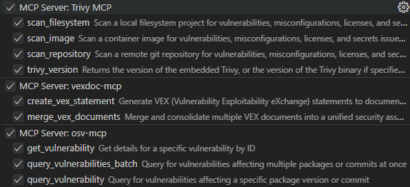
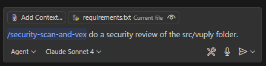
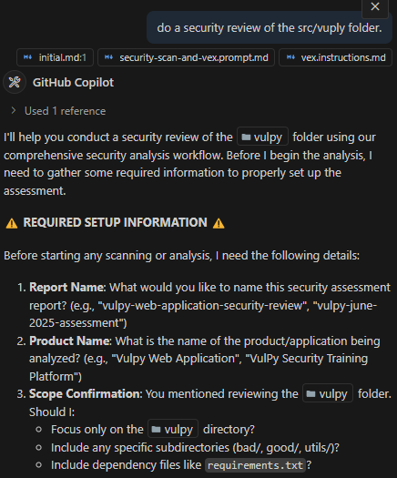
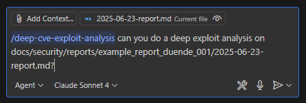

# AI-Powered Security Analysis with VEX Generation

**VEX (Vulnerability Exploitability eXchange)** tells you whether vulnerabilities actually matter in your specific environment. Instead of just listing CVEs, VEX provides context about real exploitability and practical risk assessment.

## 🚨 The Problem with Traditional Vulnerability Scanning

Traditional vulnerability scanners generate overwhelming noise - reporting every CVE found in dependencies without considering whether they're actually exploitable. Security teams waste critical time triaging hundreds of theoretical vulnerabilities while real threats go unaddressed.

**Common Issues:**
- **False Positives**: Vulnerable libraries that aren't actually reachable by attackers
- **Context Blindness**: Scanners can't evaluate runtime protections, network controls, or application-specific mitigations
- **Alert Fatigue**: Teams become desensitized to constant vulnerability reports
- **Resource Misallocation**: Critical effort spent on non-exploitable CVEs instead of real security gaps

## 🎯 Why Exploitability Analysis Matters

This workflow addresses fundamental gaps in traditional security assessment by focusing on **actual risk** rather than theoretical vulnerability presence. The exploitability analysis phase performs deep technical investigation that answers the critical question: "Can an attacker actually exploit this in our specific environment?"

**Technical Depth Required:**
- **Code Reachability Analysis**: Tracing execution paths from entry points to vulnerable functions
- **Attack Surface Mapping**: Identifying realistic attack vectors and prerequisites
- **Environmental Context**: Evaluating protective controls, deployment configurations, and runtime defenses
- **Exploitation Feasibility**: Assessing real-world conditions needed for successful attacks

**Beyond CVE Catalogs:**
While CVE databases document known vulnerabilities, they can't evaluate your specific implementation context. A CVE marked "Critical" may be completely unexploitable due to how your application is architected, deployed, or protected. Conversely, application-specific vulnerabilities not captured in any CVE database may pose significant risk.

**Supply Chain Transparency:**
VEX documents provide standardized communication about vulnerability status across development teams, security organizations, and third-party vendors. Instead of blanket vulnerability reports, stakeholders receive evidence-based determinations about actual risk exposure.

## What You Get

This automated workflow generates three comprehensive security deliverables:

1. **📄 Summary** - Executive overview of critical findings
2. **📋 Security Reports** - Detailed technical analysis with exploitability details and remediation guidance
3. **🔒 VEX Document** - Industry-standard OpenVEX-compliant exploitability determinations generated using the VEX Document MCP Server

**📁 Example Reports**: [docs/security/reports/](docs/security/reports/)

## Two Modes of Operation

This project provides two complementary security analysis workflows:

### 🔍 **Mode 1: Security Scan & VEX Generation**
Complete security assessment workflow that scans your application, analyses exploitability, and generates standardized VEX documentation.

**Use when:** Starting security assessment from scratch or need comprehensive vulnerability analysis

### 🎯 **Mode 2: Deep CVE Exploit Analysis** 
Advanced exploit analysis that takes existing security reports and creates detailed technical documentation for each CVE vulnerability.

**Use when:** You have existing security reports and need deeper technical analysis for specific CVEs

## Why This Approach Matters

Traditional vulnerability scanners generate overwhelming noise - reporting every CVE found in dependencies without considering actual exploitability. This project focuses on **evidence-based risk assessment** rather than theoretical vulnerability presence.

**Key Benefits:**
- **🎯 Evidence-Based Analysis**: Every determination backed by concrete technical proof
- **🔍 Beyond CVE Scanning**: Discovers application-specific vulnerabilities through OWASP Top 10 review
- **📊 Risk-Based Prioritization**: Focus resources on vulnerabilities that pose actual threat
- **📋 Industry Standards**: OpenVEX-compliant documents for transparent vulnerability communication
- **⚡ Automated Intelligence**: Combines scanning tools with human-level security analysis

## Getting Started

### 1️⃣ `Mode 1`: Security Scan & VEX Generation

**Complete end-to-end security assessment workflow**

1. **Start Assessment**: Open GitHub Copilot and use the security scan prompt
2. **Provide Details**: Copilot will ask for:
   - **Report Name**: `my-app-security-assessment`
   - **Product Name**: `my-application`
   - **Scope**: `src/` (directories to analyze)

3. **Automated 4-Step Process**:
   - 🔍 **Comprehensive Scanning**: Trivy identifies CVEs, misconfigurations, secrets, and license issues
   - 🧠 **Exploitability Analysis**: Rigorous technical analysis determining actual exploitability
   - 🔒 **OWASP Top 10 Review**: Manual review for application-specific vulnerabilities
   - 📋 **VEX Documentation**: Generate OpenVEX-compliant industry-standard documents

**Results**: Three deliverables automatically saved to `docs/security/reports/[report-name]/`:
- 📄 **Summary** - Executive overview of critical findings
- 📋 **Security Report** - Detailed technical analysis with remediation guidance
- 🔒 **VEX Document** - Industry-standard exploitability determinations

### 2️⃣ `Mode 2`: Deep CVE Exploit Analysis

**Advanced technical analysis for existing security reports**

1. **Prerequisites**: Existing security report with CVE findings (from Mode 1 or other sources)
2. **Start Analysis**: Open GitHub Copilot and use the deep CVE analysis prompt
3. **Select Report**: Copilot will show available reports in `docs/security/reports/`

4. **7-Step Deep Analysis Process**:
   - 📊 **CVE Report Analysis**: Extract and prioritize ALL CVEs from existing reports
   - 🔍 **Intelligence Gathering**: Deep research using vulnerability databases
   - 🧩 **Library Integration Analysis**: Trace vulnerable library usage in application context
   - 🎯 **Exploit Development**: Create theoretical proof-of-concept demonstrations (documentation only)
   - 📋 **Individual CVE Documentation**: Generate detailed exploit analysis per CVE
   - ⏭️ **Progress Tracking**: Manage analysis queue and context clearing
   - 📊 **Executive Summary**: High-level overview after processing multiple CVEs

**Results**: Enhanced documentation with detailed exploit scenarios:
- � **Individual CVE Documents**: `[CVE-ID]-exploit-analysis.md` per vulnerability
- 📊 **Executive Summary**: `executive-summary-exploit-analysis.md` with business impact
- 🎯 **Prioritized Findings**: Risk-based ordering of exploitable vs non-exploitable CVEs

## Prompts & Instructions

- **📖 Global Instructions**: [.github/instructions/vex.instructions.md](.github/instructions/vex.instructions.md) - Applies to both modes
- **🔨 MCP Tools**: Ensure these MCP tools are made available to the agent.
    
- **🔍 Mode 1 Prompt**: [.github/prompts/security-scan-and-vex.prompt.md](.github/prompts/security-scan-and-vex.prompt.md)
    

    

- **🎯 Mode 2 Prompt**: [.github/prompts/deep-cve-exploit-analysis.prompt.md](.github/prompts/deep-cve-exploit-analysis.prompt.md)
    
- **📁 Example Reports**: [docs/security/reports/](docs/security/reports/)

## Setup

**Development Container**: Pre-configured with all tools and MCP servers. Simply open in VS Code with Dev Containers extension.

**Manual Setup**: If not using the dev container, install these prerequisites:

```bash
# Clone and setup
git clone <repository>
cd ai_generated_vex
make setup  # Installs all required tools

# Start MCP servers
make start-osv-mcp-server
```

**Prerequisites Required:**
- **Docker** - For OSV MCP server
- **Go** (v1.24+) - For vexctl installation
- **Node.js** (v22+) - For vexdoc-mcp installation
- **Trivy** (v0.63.0+) - Security scanner

### MCP Configuration

The following MCP servers are automatically configured in the dev container:

```json
{
    "servers": {
        "Trivy MCP": {
            "type": "stdio",
            "command": "trivy",
            "args": ["mcp"]
        },
        "vexdoc-mcp": {
            "type": "stdio",
            "command": "npx",
            "args": ["vexdoc-mcp"]
        },
        "osv-mcp": {
            "type": "http",
            "url": "http://localhost:3001/mcp"
        }
    }
}
```

### Helpful Commands

```bash
make help                  # Show all available commands
make setup                 # Install all required tools and dependencies
make start-osv-mcp-server  # Start the OSV MCP server
make stop-osv-mcp-server   # Stop the OSV MCP server
make status-osv-mcp-server # Check OSV MCP server status
```

## Documentation & Examples

- **📖 Complete Instructions**: [.github/instructions/vex.instructions.md](.github/instructions/vex.instructions.md)
- **📁 Example Reports**: [docs/security/reports/](docs/security/reports/)
- **🔗 VEX Specification**: [OpenVEX](https://github.com/openvex/spec)

## Related Projects

- [Trivy MCP](https://github.com/aquasecurity/trivy-mcp) - Security scanning MCP server
- [VEX Document MCP Server](https://github.com/rosstaco/vexdoc-mcp) - VEX document generation
- [OSV MCP Server](https://github.com/StacklokLabs/osv-mcp) - Vulnerability intelligence
- [Vulpy Test App](https://github.com/fportantier/vulpy) - Vulnerable Python application for testing
